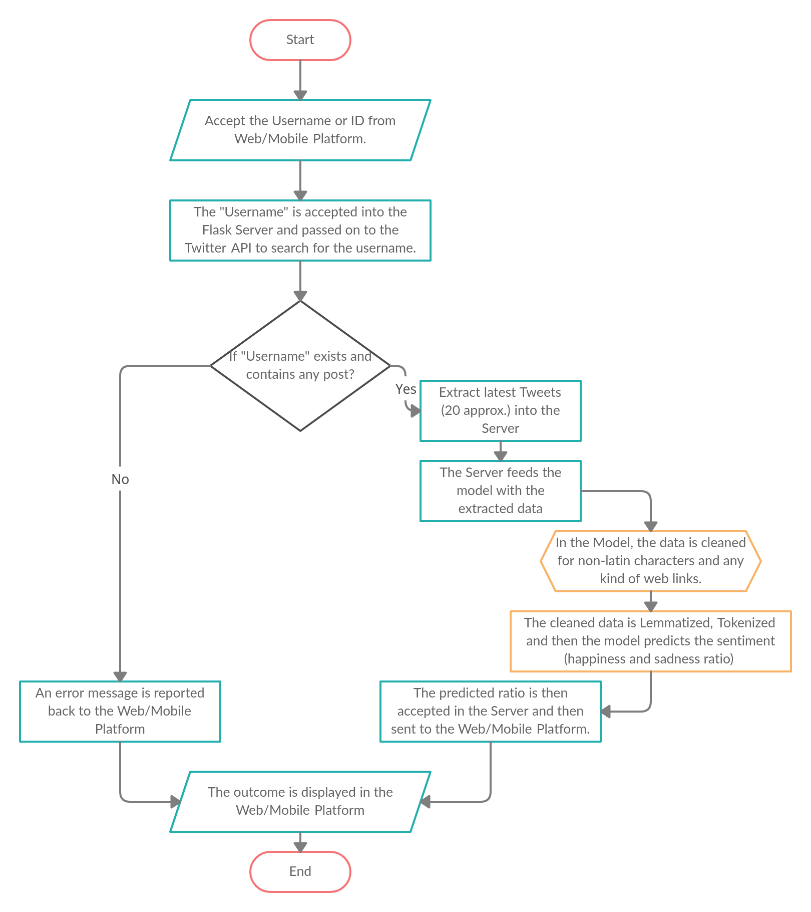

# Sentinum--Sentiment-Analysis-using-Social-Media-Data

#### Languages

#### Machine Learning Packages

#### Frameworks

#### Hosting

## Contents

1. [Introduction](https://github.com/swapnanildutta/Sentinum--Sentiment-Analysis-using-Social-Media-Data#introduction)
2. [Problem Statement](https://github.com/swapnanildutta/Sentinum--Sentiment-Analysis-using-Social-Media-Data#)
3. [Theoretical Approach]()
4. [Tech Stacks Used]()
5. [Machine Learning Model]()
    1. [Resources Used](https://github.com/swapnanildutta/Sentinum--Sentiment-Analysis-using-Social-Media-Data/tree/ml-model-training#resources-used)
    2. [Natural Language Toolkit](https://github.com/swapnanildutta/Sentinum--Sentiment-Analysis-using-Social-Media-Data/tree/ml-model-training#natural-language-toolkit)
6. [Backend Serving API](https://github.com/swapnanildutta/Sentinum--Sentiment-Analysis-using-Social-Media-Data/tree/backend-api)
    1. 
7. [Mobile Application](https://github.com/swapnanildutta/Sentinum--Sentiment-Analysis-using-Social-Media-Data/tree/flutter-application)
8. [Web Application]()
9. [Scope of Work]()
10. [References](https://github.com/swapnanildutta/Sentinum--Sentiment-Analysis-using-Social-Media-Data/tree/main#references)

## Introduction

In this project, we are using the Sentiment Analysing algorithm to predict the emotional state of an individual based on the data input from the person's social media posts and interactions. To perform this analysis, we use an interactive platform like the website or the mobile application and take the user authorized account name and process the data accordingly in our server and finally display the result of analysis performed i.e. the emotional state of the individual whose account name was provided. The main motive behind this project is to predict the mental health of a person during the lockdown period. When a person is locked-up in his home, he/she express his/her emotion through social media posts.

## Problem Statement

The main thought behind the project is to predict the average sentiment/mood of the user during the period of the “Lockdown” from their social media posts. We will feed our algorithm with the data from the user’s account and our AI model will predict the “then” sentiment of the user. Sentiment analysis is the interpretation and classification of emotion(positive, negative, neutral).

## Theoretical Approach

The problem is a very challenging one for us. But the basic approach we are devising is very simple. First, we will be asking the user to enter the username of his/her. We will then process the username and fetch the data from the Twitter database using the Tweepy API. Then we will pass the data through our pre-trained model to analyze the photo and determine the state of it. In this case, we will not be storing any kind of data. The below diagram will help it understand better

We will be using Heroku as our hosting server for API and backend activities. Our web platform will be running on an Heroku web server. Note:-For now we will only be using the Twitter database and not any other social media platform.The reason behind this is because Facebook and Instagram only provide data to verified organizations, due to their privacy policies.

## Techstack Used

- [**Machine Learning Model**](https://github.com/swapnanildutta/Sentinum--Sentiment-Analysis-using-Social-Media-Data/tree/ml-model-training)
  - NLTK Toolkit for Data processing and cleaning
  - Sentinum140 dataset
  - XGBoost Classifier
- [**Backend Serving API**](https://github.com/swapnanildutta/Sentinum--Sentiment-Analysis-using-Social-Media-Data/tree/backend-api)
  - Tweepy Package
  - Flask Framework with Python3 Language
-

## Scope of Work

#### Here are some of the ideas we have for this project in the future:

- Login system and personal accounts with email/mobile verification for individual users to record search histories as well as recording some valuable feedback and also users may add nominee/nominees.
- Each personal account may link their social media id/username and he/she may get the predicted result spontaneously and also they can automate their account scoring and this will help us to produce more granular results and also can be used for further analysis and visualization.
- Currently, our app supports only English for predicting the sentiment of the searched username. Later we intend to add more language support.
- Currently, our app supports only searches made on Twitter. Later we intend to add some more social media platforms.
- Related to the personal accounting system, we also plan to add an SMS notification feature, where if the person’s own predicted happiness ratio becomes low, the nominee/nominees will be notified that the person has added you as a nominee and according to our analysis he/she may be feeling depressed. Hope you help him/her out.
- We also intend to integrate our app with voice assistants like Google Assistant, Alexa, Siri, etc.
- Lately, we intend to add some offline text analyzing system, using Tensorflow Lite within our Mobile Application.

## **References**

API:

- [https://medium.com/@aakashgoel12/my-first-simple-nlp-based-heroku-app-5-easy-steps-to-deploy-flask-application-on-heroku-bed53ebcbc6e](https://medium.com/@aakashgoel12/my-first-simple-nlp-based-heroku-app-5-easy-steps-to-deploy-flask-application-on-heroku-bed53ebcbc6e)
- [https://towardsdatascience.com/create-an-api-to-deploy-machine-learning-models-using-flask-and-heroku-67a011800c50](https://towardsdatascience.com/create-an-api-to-deploy-machine-learning-models-using-flask-and-heroku-67a011800c50)
- [http://docs.tweepy.org/en/v3.2.0/getting_started.html#introduction](http://docs.tweepy.org/en/v3.2.0/getting_started.html#introduction)

ML Model:

- [https://www.nltk.org/](https://www.nltk.org/)

Mobile Application:

- [https://flutter.dev/docs](https://flutter.dev/docs)

Web Application:

- [https://getbootstrap.com/docs/4.5/getting-started/introduction/](https://getbootstrap.com/docs/4.5/getting-started/introduction/)
- [https://www.w3schools.com/bootstrap/](https://www.w3schools.com/bootstrap/)
- [https://stackoverflow.com/questions/35410228/how-to-get-status-code-when-using-after-request](https://stackoverflow.com/questions/35410228/how-to-get-status-code-when-using-after-request)
- Flask Web Development: Developing Web Applications with Python- by Miguel Grinberg
